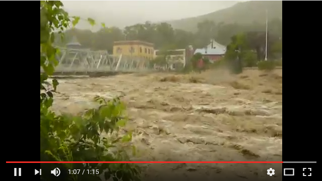

# Shelburne Falls, MA, U.S.A.
### For this project I wanted to look at the flood risk posed by the Deerfield River, on the town of Shelburne Falls, Massachusetts. This town has been affected in the past by flood events, and having a better picture of specific areas which could be problematic in future flood events, could be extremely beneficial. 

-This is a link to a youtube video of a flood caused by Hurricane Irene in 2011

# Area Extent

<iframe src="https://www.google.com/maps/embed?pb=!1m18!1m12!1m3!1d34450.709801822435!2d-72.73809975498386!3d42.60377159477566!2m3!1f0!2f0!3f0!3m2!1i1024!2i768!4f13.1!3m3!1m2!1s0x89e0d7bfd0c8bfb5%3A0xbf75623f5b5a9f70!2sShelburne+Falls%2C+MA+01370!5e1!3m2!1sen!2sus!4v1487430057538" width="600" height="450" frameborder="0" style="border:0" allowfullscreen></iframe>

# A Bit about Remote Sensing and LIDAR
### Our main data source was a LIDAR point cloud obtained from the National Oceanic and Atmospheric Administration’s coastal LIDAR data portal. LIDAR, which is a type of sensor that is generally on an airplane or satelite, fires laser pulses at the ground, and records their return signatures. This gives us a very accurate representation of the elevation of the surface of what the laser pulse hit. The resulting set of elevation points is what we refer to as a Point Cloud. The point cloud for our Data is made of 2,093,340 points. 

-Below we have an image of the point cloud of our data. The different colours represent various elevations. 

