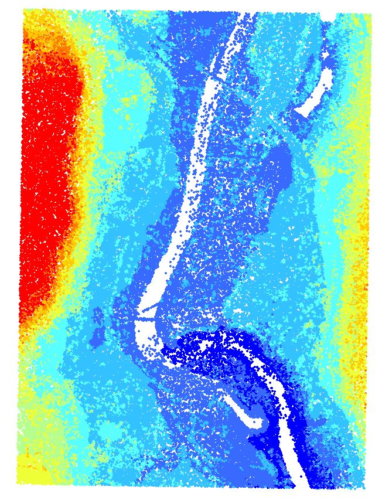
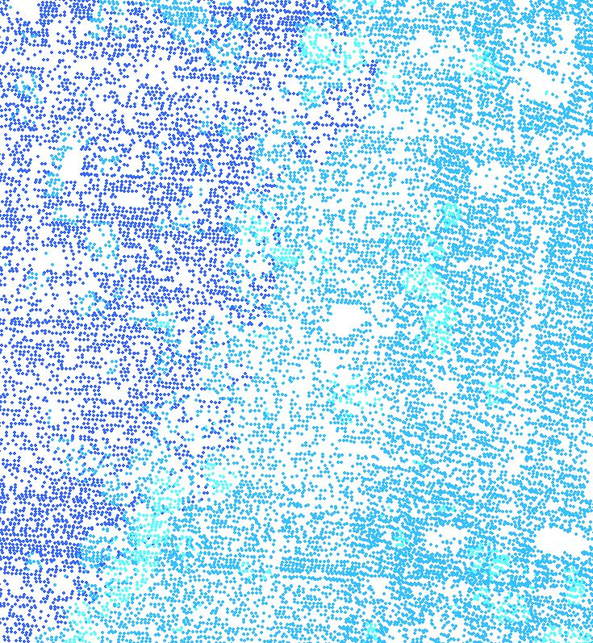
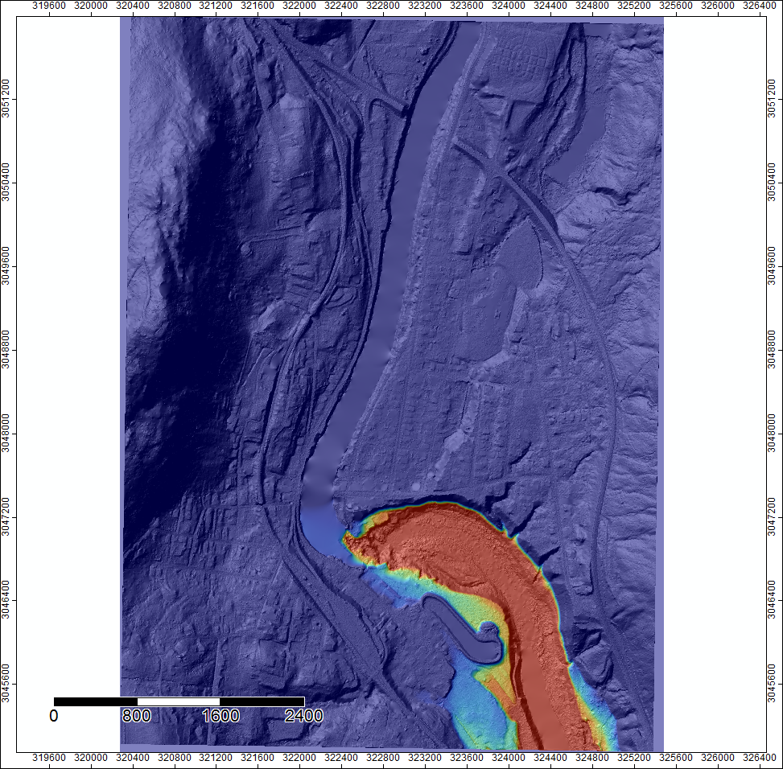
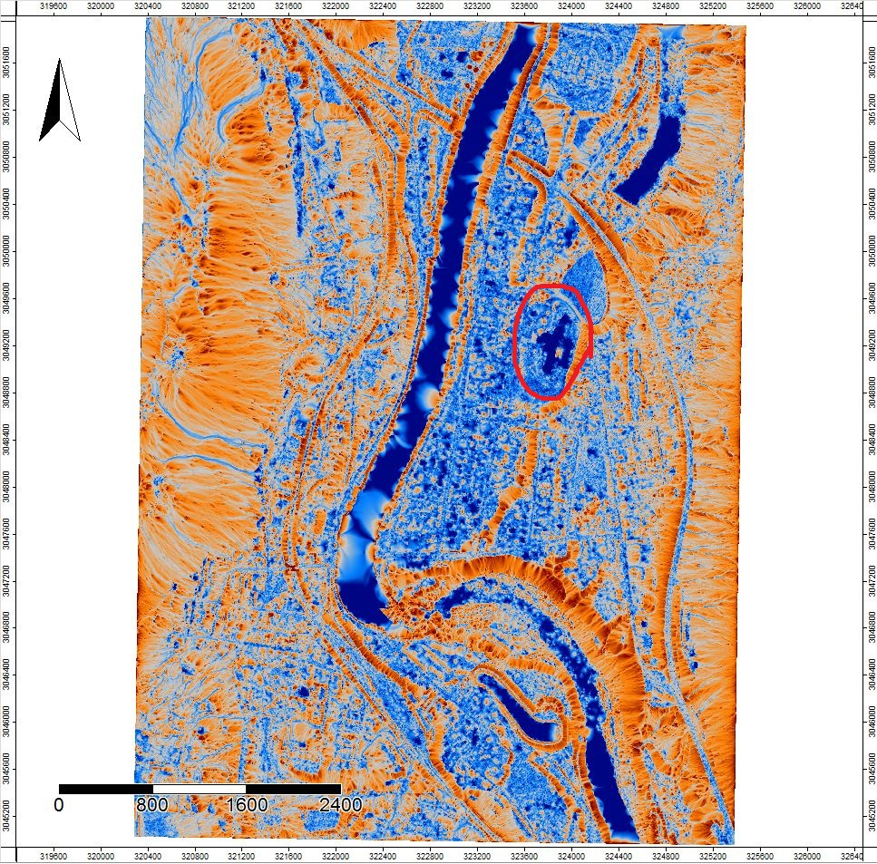

# Shelburne Falls, MA, U.S.A.
### For this project I wanted to look at the flood risk posed by the Deerfield River, on the town of Shelburne Falls, Massachusetts. This town has been affected in the past by flood events,depicted in the video below, and having a better picture of specific areas which could be problematic in future flood events, could be extremely beneficial. 
* ###### The subset of the data used in this project was generated from a larger data set named: "2012 FEMA Topographic Lidar: Hudson-Hoosic and Deerfield Watersheds, Massachusetts" which was obtained from The National Oceanic and Atmospheric Administration (NOAA), specifically thier website at the following adress: https://coast.noaa.gov/dataviewer/#/

- *Below we have a youtube video of the flooding in the town of Shelburne Falls which was caused by Hurricane Irene in 2011.*

<iframe width="560" height="315" src="https://www.youtube.com/embed/-YuQWLGA870" frameborder="0" allowfullscreen="allowfullscreen"></iframe>

 

<iframe width="560" height="315" src="https://www.youtube.com/embed/p47txwmuwCY" frameborder="0" allowfullscreen="allowfullscreen"></iframe>

 

# Project Area Extent

- This is a map of the location of the project

- Below we have an embeded Google map, with which you can view the loacation of the project.
<iframe src="https://www.google.com/maps/embed?pb=!1m18!1m12!1m3!1d34450.709801822435!2d-72.73809975498386!3d42.60377159477566!2m3!1f0!2f0!3f0!3m2!1i1024!2i768!4f13.1!3m3!1m2!1s0x89e0d7bfd0c8bfb5%3A0xbf75623f5b5a9f70!2sShelburne+Falls%2C+MA+01370!5e1!3m2!1sen!2sus!4v1487430057538" width="600" height="450" frameborder="0" style="border:0" allowfullscreen></iframe>

 

# A Bit about Remote Sensing and LIDAR
### Our main data source was a LIDAR point cloud obtained from the National Oceanic and Atmospheric Administration’s coastal LIDAR data portal. LIDAR, which is a type of sensor that is generally on an airplane or satelite, fires laser pulses at the ground, and records their return signatures. This gives us a very accurate representation of the elevation of the surface of what the laser pulse hit. The resulting set of elevation points is what we refer to as a Point Cloud. The point cloud for our Data is made of 2,093,340 points. 

- *Below we have an image of the point cloud of our data. The different colours represent various elevations. Red being higher and dark blue being lower.*

- 8Below we have a zoomed in version of the point cloud showing how dense the points are. This data has a point density of 2 points per square meter.*

- *Below we have an interactive form of the point cloud, which you can manipulate and see from any angle and zoom in on. Please play with this to gain a better understanding of the point cloud concept. *
<iframe width="560" height="315" src="https://dl.dropboxusercontent.com/u/106681985/Daniel_Clement_Site/portal.html" frameborder="0" allowfullscreen="allowfullscreen"></iframe>

 

# Flood Analysis
### For this project we will use an open source program called SAGA GIS to perform and create various analysis and visualizations. One of the first analysis we will perform is a Flood simulation showing what would happen if there was a 2.5 foot increase in the depth of the river and the dam could not hold it. 

- *In the image below we have a digital terrain model which shows the surface of the ground, which is overlayed by the flood simulation. Here the red shadded areas signify the worst flooding and the blue areas represent less flooding.*
 
 

- *In the image below, we are seeing is the result of the Topographic Wetness Index analysis. This uses the micro-topography, or small changes in elevation, to determine areas which would tend to hold water. This is important to visualize because it shows us areas which are more vulnerable to flooding. This knowledge can lead to better planning, which can seriously diminish the severity of future flood events. Some interesting features to note here are that to the East of the river, the wetness index is very high compared to the western side. This leads us to believe it would be beneficial to focus on this area in flood prevention planning. Another area which could be at risk is the school which is circled in red. This area is very blue, signifying this area is in a low spot and should be another area of focus.*

 

# Conclusions
### In this project we looked at the town of Shelburne Falls, located in North Western Massachusetts, U.S.A. our goals were to analyze the flood risk posed in a theoretical 2.5 foot flood. As a result of this analysis we have identified several areas which could be succeptable to flooding in the future. 

##### *Project By: Daniel Clement*
