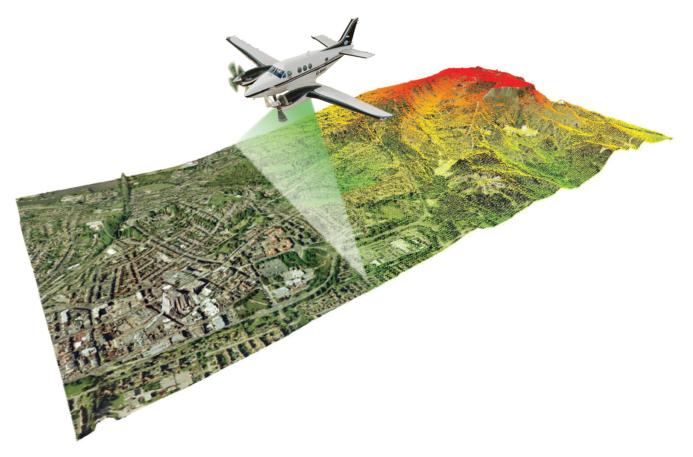

# Shelburne Falls, MA, U.S.A.
##### **Project By: Daniel Clement**

### This project will examine the flood risk posed by the Deerfield River, on the town of Shelburne Falls, Massachusetts. This town has been affected in the past by flood events, depicted in the video below. Having a better picture of specific areas which could be problematic in future flood events would be extremely useful. To this end I have performed analysis on the area and will make recommendations on problem areas that official government planners, first response agencies such as FEMA, as well as local authorities can use to plan for future disasters.
* ###### The subset of the data used in this project was generated from a larger data set entitled: "2012 FEMA Topographic Lidar: Hudson-Hoosic and Deerfield Watersheds, Massachusetts" which was itself obtained from The National Oceanic and Atmospheric Administration (NOAA), and their website at the following links:
 1. [NOAA Costal Data](https://coast.noaa.gov/dataviewer/#/) - https://coast.noaa.gov/dataviewer/#/
 2. [Direct Link to Project Data](https://coast.noaa.gov/dataviewer/#/lidar/search/-8098894.886584386,5250798.662221772,-8095932.951738335,5254343.429408497) - https://coast.noaa.gov/dataviewer/#/lidar/search/-8098894.886584386,5250798.662221772,-8095932.951738335,5254343.429408497

- *Below are two YouTube video of the flooding in the town of Shelburne Falls which was caused by Hurricane Irene in 2011. They show the true power and devastation of these flood events and illustrate why it is important to do studies such as this one.*

<iframe width="560" height="315" src="https://www.youtube.com/embed/-YuQWLGA870" frameborder="0" allowfullscreen="allowfullscreen"></iframe>

 

<iframe width="560" height="315" src="https://www.youtube.com/embed/p47txwmuwCY" frameborder="0" allowfullscreen="allowfullscreen"></iframe>

 

# Project Area Extent

- This is a map of the location of the project made with ESRI's ArcGIS. 

- Below we have an embeded Google map, in which you can view the loacation of the project.
<iframe src="https://www.google.com/maps/embed?pb=!1m18!1m12!1m3!1d34450.709801822435!2d-72.73809975498386!3d42.60377159477566!2m3!1f0!2f0!3f0!3m2!1i1024!2i768!4f13.1!3m3!1m2!1s0x89e0d7bfd0c8bfb5%3A0xbf75623f5b5a9f70!2sShelburne+Falls%2C+MA+01370!5e1!3m2!1sen!2sus!4v1487430057538" width="600" height="450" frameborder="0" style="border:0" allowfullscreen></iframe>

 

# A Bit about Remote Sensing and LIDAR
### Our main data source was a LIDAR point cloud obtained from the National Oceanic and Atmospheric Administration’s coastal LIDAR data portal. LIDAR, which is a type of sensor that is generally on an airplane or satellite, fires laser pulses at the ground, and records their return signatures. This gives us a very accurate representation of the elevation of the surface of what ever the laser pulse hit. The resulting set of elevation points is what we refer to as a Point Cloud. The point cloud for our Data is made of 2,093,340 points. 

- *The first image below is an illustration of how LIDAR sensors are used to collect data. LIDAR sensors are commonly placed in the belly of light aircraft, flying at relatively low altitude.  Source: LIDAR-America.com*

- *Below is an image of the point cloud of our data. The different colors represent various elevations, red symbolizing higher and dark blue being lower in elevation.*

- Below is a zoomed in version of the point cloud showing how dense the points are. This data has a point density of 2 points per square meter.*

- *Below is an interactive form of the point cloud, which you can manipulate and see from any angle and zoom in on. Please play with this to gain a better understanding of the point cloud concept. *
<iframe width="560" height="315" src="https://dl.dropboxusercontent.com/u/106681985/Daniel_Clement_Site/portal.html" frameborder="0" allowfullscreen="allowfullscreen"></iframe>

 

# Flood Analysis
### For this project we will use an open source program called SAGA GIS was used to perform and create various analysis and visualizations. One of the first analysis performed is a flood simulation showing what would happen if there was a 2.5 foot increase in the depth of the river and the dam overflowed. 

- *In the image below we have a digital terrain model which shows the surface of the ground, which is overlayed by the flood simulation. This shows that there are several buldings and houses at risk inside the flood zone. Here the red shadded areas signify the worst flooding and the blue areas represent less flooding.*
 
 

- *The image below, displays the result of the Topographic Wetness Index analysis. This uses the micro-topography, or small changes in elevation, to determine areas which would tend to hold water. This is important to visualize because it shows us areas which are more vulnerable to flooding. In addition, this knowledge can lead to better planning, which can seriously diminish the severity of the effects of future flood events. Some interesting features to note here are that to the East of the river, the wetness index is very high compared to the western side. This leads us to believe it would be beneficial to focus on this area in flood prevention planning. Another area which could be at risk is the school which is circled in red. This area is very blue, signifying this area is in a low spot and should be another area of focus.*

 

# Conclusions
### The town of Shelburne Falls, located in North Western Massachusetts, U.S.A has been the victim of floods in the past. With this in mind, this project set goals to analyze the flood risk posed in a theoretical 2.5 foot flood. As a result of this analysis we have identified several areas which could be succeptable to flooding in the future. The entire Eastern shoreline is low, and will tend to hold water. This could pose particularly problematic for one public school, Buckland-Shelburne Elementary, which is located in this area.

 

# Recommendations
### Past events, such as flood in 2011 caused by Hurricane Irene, clearly illustrate the importance of being prepared for future disasters. Proper prevantative emergency planning could go a long way towards protecting people and property in the next flood event. Performing a flood analysis on Deerfield river provided several insights. Namely, several areas which are more susceptible to flooding than others. These areas are the entire Eastern side of the river inside the town of Shelburne Falls. This area is low in elevation and would trap water in a flood situation. One important feature which would be at severe risk is Buckland-Shelburne Elementary. This school is situated under 900 feet away from the bank of the Deerfield River. I would recommend a risk mitigation study be performed by engineers, and a plan developed to minimize the danger to this school as well as the surrounding area.  

 

# Further Readings
1. [Flood-Inundation Maps for the Deerfield River, Franklin County, Massachusetts, From the Confluence With the Cold River Tributary to the Connecticut River; USGS](https://pubs.usgs.gov/sir/2015/5104/sir20155104.pdf) https://pubs.usgs.gov/sir/2015/5104/sir20155104.pdf

 

# Applications used:
1. SAGA GIS -                  [http://www.saga-gis.org/en/index.html](http://www.saga-gis.org/en/index.html) 
2. RapidLasso's LAStools -     [https://rapidlasso.com/lastools/](https://rapidlasso.com/lastools/)
3. ESRI's ArcGIS -             [http://www.esri.com/arcgis/about-arcgis](http://www.esri.com/arcgis/about-arcgis)
4. GitHub -                    [https://github.com/](https://github.com/)

##### **Project By: Daniel Clement**
